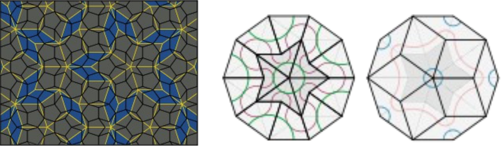

Penrose muster (penrose tiling)
----
Penrose muster on ühesuguste geomeetriliste elementide asetus aperioodilise mustrina- viisnurkgeomeetrial põhinevate kujundid moodustavad kvaasikristalse (quasicristal) struktuuri.  

Penrose mustri elementideks võivad olla:

- kaks erinevate nurkade kuid samade küljepikustega rombi (P3)
- nn „kilp“ ja „nool“ (P2)  

Elemendid paigutatakse vastavalt kindlatele reeglitele, et moodustuks aperioodiline muster.  
Nimetus tuleneb matemaatik Roger Penrose nimest, kes esmakodselt 1974.a. kirjeldas sellist geomeetrilist struktuuri.

-

-

Disainis võib sellist matemaatilist mudelit rakendada erinevate dekoorpindade modeleerimiseks.

- Väheste elementide kombineerimine võimaldab mitmekesiste mustrite konstrueerimist.
- Muster on aperioodiline- vaatamata kindlatele reeglitele, mille järgi muster konstrueeritakse on joonis nii kordumatu kui ka lõppematu. Samas võib vajadusel kasutada nii telgsümmeetriat kui ka pöördsümmeetriat.
- Mustri matemaatilisel korrapäral põhinev esteetika. Mustri elemendid alluvad klassikalise kuldlõike reeglitele.  

On leitud, et mõned islamimaade mustrid omavad sarnast geomeetrilist ülesehitust.

Penrose geomeetriat on kasutatud „ehituskividest“ koosnevate pinnakatete kujudamisel: tänavakivid, keraamiline plaat, hoonete fasaadid.

-

-

-

Betoonkividest tänavasillutis
----

Urbanistliku maastiku üheks põhiliseks kujunduselemendiks ón erinevad pinnakatted, olgu selleks looduslikud murukattega alad, asfaltkattega teed, kummimattid lastemänguväljakul, hoovialade erinevad lahendused. Kogu majadevaheline ala on kaetud erinevate pinnakatetega, mille kujundus loob tausta ümbritsevale.

Jalakäigualade- kõnniteede, väljakute, hoovialade kujundamisel on levinuim lahedus tänavasillutis. Näiteks sillutiskivdega kaetud eramajade kinnistul paiknev autoparkimisala on tihtipeale domineeriv element tänavapoolses hooviosas. Suured sillutiskividega kaetud alad moodustuvad ostukekuste ja teiste avaliku funktsiooniga hoonete ette ja autoparklate ümber.

Sillutiskivikattega alade kavandamisel eelistatakse tihtipeale lihtsalt odavaimat lahendust, investeerides rohkem näiteks haljastusse või õuemööblisse. Oluliseks peetakse eelkõige ehituslikku kvaliteeti ja vastupidavust. Avarad betoonkividega kaetud pinnad näivad monotoonsete, ilmetute, ühetaoliste, võibolla isegi koledatena.

-

-

Samas on olukordi kus nõutakse erilist disainlahendust. Mitmesuguste maastikukujudusobjektide- väljakute ja platside, promenaadide, vahel ka hoovialade kujundamisel on oluline esteetiline kvaliteet ja omanäolisus. Sillutispindade liigendamiseks, mustrite ja faktuurpindade loomiseks kasutatakse erinevaid looduskivisid, klinkertelliseid, erineva tooni ja vormiga beetoonkivisid. Siin on oluline võimaluste mitmekesisus.

Penrose mustriga sillutiskivikate.
----

Penrose geomeetrial põhinev muster sobib hästi bettoonkivisillutise kujundamiseks. Kahe, kolme, nelja eri värvi, või faktuuriga kivi kombineerimine võimaldab luua tapeedilaadse pinnakujunduse. Mustri aperioodilisus erineb tavapärastest lahendustest- vuugijoonte ja eri värvi kivide rütm moodustavad ootamatuid kombinatsioone ja seoseid. Iga kujunduslik lahendus on kordumatu, võimaluste mitmekesisus piiramatu.

Betooni kui valukivi kasutamine penrose mustri elementide materjalina võimaldab erinevaid tehnilisi lahendusi: 

- kivi sisse valatud jooned moodustavad mustris keerulise geomeetrilise joonise.
- samade valuvormide kasutamine, erinevate värvitooniga kivide valamiseks suurendab mitmekesisust. 
- betoonist murukivi „aukude“ rütm on aperioodiline (kuigi korrapärane).

Lisan mõned penrose geomeetrial põhinevad mustrid.
Mustrite modeleerimiseks on kasutatud kahte erinevat „ehituskivi“

veebruar 2016,  
Jüri Martson